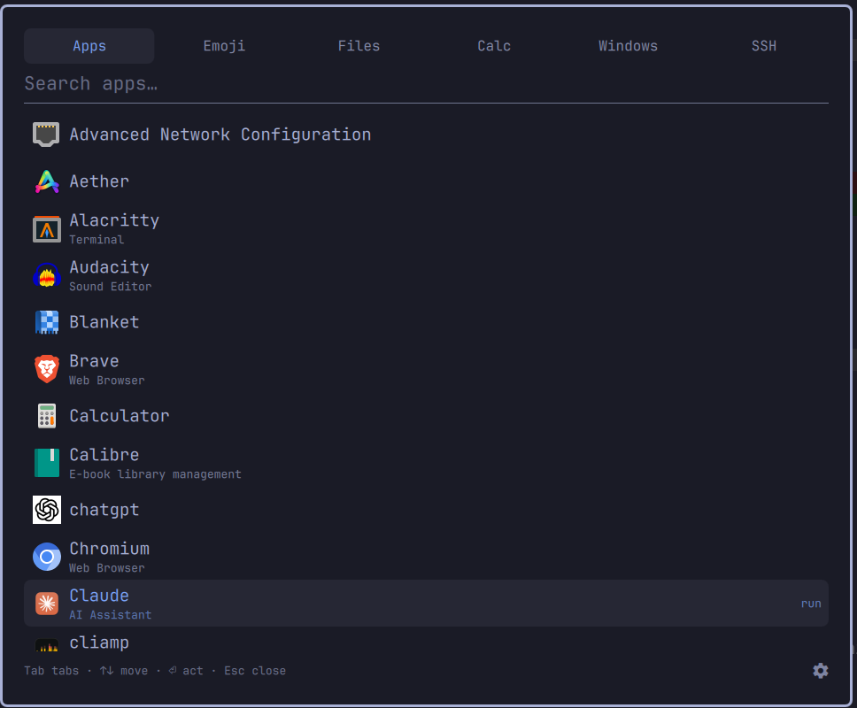

# Zenbu

**全部 — a theme-aware launcher for everything.**

Zenbu is an everything-launcher for [Omarchy](https://omarchy.org): press one
key and get six tabs — Apps, Emoji, Files, Calc, Windows, and SSH — in a
single overlay that is themed by your active Omarchy theme, automatically,
with no configuration. It is built for the keyboard, like the rest of
Omarchy: type to filter, Tab to change tabs, Enter to act, Esc to leave.

You decide how it appears. On first open a short greeter walks you through
the choices — which hotkey should summon it (you press the keys, nothing is
predefined), whether it pops up in the middle of the screen or drops down
from a bar icon, whether to show the 全 icon in the bar at all (and where),
and what clicking an emoji does. Every choice can be changed later from the
⚙ in the footer, or Ctrl + comma.



## The tabs

- **Apps** — every installed application, with icons, fuzzy-searched by the
  shell's own app library. Enter launches.
- **Emoji** — search by name ("shrug", "fire"), shown large enough to
  actually tell apart. Enter types the emoji into the app you came from.
- **Files** — type part of a filename and get instant results from across
  your home folder, hidden dot-folders like `~/.config` included (a
  settings toggle, on by default; powered by `fd`, with
  cache/build/backup/Steam junk excluded so it stays fast). A second
  toggle, off by default, also searches the system areas `/usr`, `/etc`
  and `/opt`. Enter opens with the default app. An empty search shows
  your home folder.
- **Calc** — a live calculator and unit converter on the full qalculate
  engine: `6 feet to meters`, `15% * 4300`, `sqrt(2)`. Enter copies the
  result. `100 euros in jpy` works as well as `to`, and currency answers
  carry the date of the rates they were worked out from — see
  [Exchange rates](#exchange-rates).
- **Windows** — every open window; Enter focuses it.
- **SSH** — the hosts from your `~/.ssh/config`; Enter connects in a
  terminal.

## Keys

| Key | Action |
|-----|--------|
| type anything | Filter the current tab |
| `Tab` / `Shift+Tab` | Next / previous tab |
| `←` / `→` | Previous / next tab |
| `↑` / `↓` / `PgUp` / `PgDn` | Move the selection |
| `Enter` | Launch / type / open / focus / connect / copy |
| `Ctrl` + comma | Open settings |
| `Esc` | Clear the search, then close |

The mouse works too: click a tab, click a row, and drag any edge or corner
of the card to resize it — the size is remembered. A fixed footer shows the
keys, with the ⚙ settings on its far right.

## Install

```bash
omarchy plugin add https://github.com/weedwhitesandwine/Zenbu.git --enable
```

Then open it once by hand to meet the greeter:

```bash
omarchy-shell shell toggle io.github.weedwhitesandwine.zenbu
```

The greeter records your hotkey (press the keys you want — pick a
combination nothing else uses), your summon style (centered pop-up, or
dropdown from the bar icon), and whether the 全 bar icon is shown. From
then on your own hotkey and/or the icon summon it.

### Requirements

- `fd` (Files tab) and `wl-clipboard` (copying) ship with Omarchy's base
  install — nothing to do.
- The Calc tab needs the `qalc` calculator, which Omarchy does **not**
  install by default. Without it the tab simply tells you so; enable it
  with one command: `omarchy pkg add libqalculate`.
- SSH connections open in your own terminal (whatever Omarchy is
  configured to use) — no specific terminal required.

## Exchange rates

qalculate answers currency conversions from a rates file, and libqalculate
ships one inside its own package — so on a fresh install `100 euros to jpy`
is worked out from whatever the rates were on the day your distribution
built that package, which can be months old.

Zenbu reads the date out of that file and prints it beside the answer
(`rates 6 Jul`), so a stale rate is always labelled as one. That happens
with the packaged file and needs nothing from you.

Refreshing it is a separate choice. Set **Exchange rates** to *refresh
daily* in settings and Zenbu runs `qalc -e` once per session, the first
time you open the Calc tab, when the rates on disk are older than today.
That is qalculate's own updater: it fetches from the European Central Bank
and writes qalculate's rates files in `~/.local/share/qalculate/`, which
then take precedence over the packaged copy. The setting starts at
*packaged*, so this only ever happens after you turn it on.

## How it works

Zenbu is a Quickshell overlay running inside the Omarchy shell. Colors,
fonts, spacing, and corner radii all come from the shell's theme system, so
it always matches the active theme with nothing to configure. Apps come from
the shell's shared application library (the same source as the Omarchy
menu), windows from the Wayland toplevel list, emoji from Omarchy's own
emoji data, and file results from `fd` run on demand.

What Zenbu writes, and when:

- Its remembered card size and your settings, in `~/.local/state/zenbu/` —
  its own state, nothing shared.
- When you apply a hotkey in the greeter or settings (and only then), a
  clearly-marked block in `~/.config/hypr/bindings.lua` via the bundled
  `zenbu-ctl.sh`. It only ever replaces its own marked block — the rest of
  the file is never touched — and removing the hotkey removes the block.
- When you toggle the bar icon or move it (and only then), Zenbu's own
  entry in `~/.config/omarchy/shell.json`: it is placed in the bar layout
  to show the icon, or parked in the enabled-plugins list to hide it —
  only Zenbu's entry is ever touched, and the shell reloads the file
  automatically.

- When you have set **Exchange rates** to *refresh daily* (and only then),
  `qalc -e` runs once per session on first opening the Calc tab, if the
  rates on disk predate today. It is qalculate's own updater: it reaches
  the European Central Bank for current rates and writes qalculate's rates
  files in `~/.local/share/qalculate/`. The setting ships as *packaged*.

Every one of those writes is staged under an exclusively-created temporary
name beside the destination and renamed over it in one atomic step, so an
interruption never leaves a half-written file and a symlink planted at any
of those names is never written through.

The commands Zenbu runs are `fd` (file search), `qalc` (Calc tab, capped at
half a second per calculation, and `qalc -e` for the refresh above),
`python3` (reading files to a byte ceiling), `wl-copy`, `bash` for the
bundled `zenbu-ctl.sh`, and your terminal for an SSH connection. Each is
started on demand and exits on its own.

Nothing runs on a timer, and nothing is changed until you explicitly apply
it in the greeter or settings.

## Uninstall

If you set a hotkey, remove Zenbu's block from `bindings.lua` first (or
just delete the marked block by hand), then remove the plugin:

```bash
~/.config/omarchy/plugins/io.github.weedwhitesandwine.zenbu/zenbu-ctl.sh unbind
omarchy plugin remove io.github.weedwhitesandwine.zenbu
```

## License

MIT

Built with [Claude Code](https://claude.com/claude-code).
